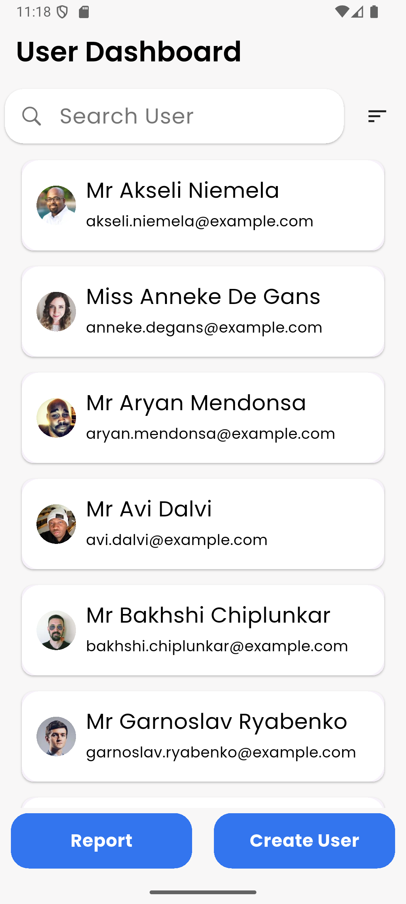
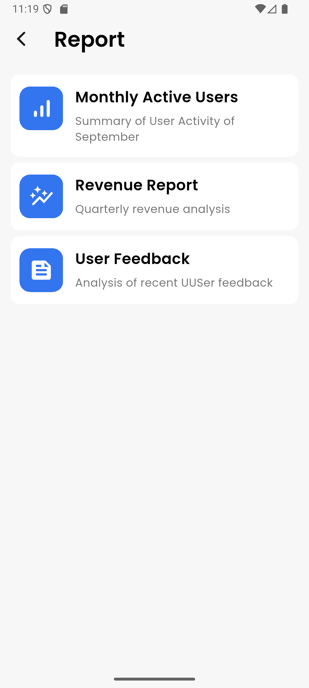
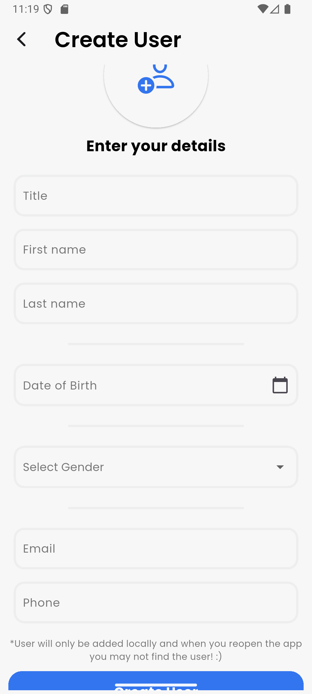

# 📱 User Dashboard App

A modern Flutter application showcasing a user-friendly dashboard with search, sorting, reporting, and user creation features.

---

## ✨ Features

- **Dashboard Screen**
  - Scrollable list of user cards with details
  - Real-time search by name (case-insensitive)
  - Sort users alphabetically (A-Z / Z-A)
  - Quick navigation to Reports and User Creation

- **Report Screen**
  - View a list of pre-defined reports
  - Clean, card-based layout

- **Create User Screen**
  - Simple form to add a new user
  - Includes name, email, gender, and more

- **State Management**
  - Powered by [Provider](https://pub.dev/packages/provider) for smooth UI updates

- **API Integration**
  - Fetches users from [randomuser.me](https://randomuser.me/api/?results=20)

---

## 🖼️ Screenshots

> Add your screenshots to the `assets/` folder and showcase them below!

<p align="center">
  
  
  
</p>

---

## 🚀 Getting Started

1. **Clone the repository**
   ```bash
   git clone https://github.com/yourusername/user_dashboard_app_assignment.git
   cd user_dashboard_app_assignment/user_dashboard
   ```

2. **Install dependencies**
   ```bash
   flutter pub get
   ```

3. **Run the app**
   ```bash
   flutter run
   ```

---

## 🛠️ Tech Stack

- **Flutter** (latest stable)
- **Provider** for state management
- **Dart** language

---

## 📂 Project Structure

```
lib/
 ├── core/
 ├── providers/
 ├── screens/
 ├── widgets/
 └── main.dart
assets/
```

---

## 📌 Assignment Details

- No bottom navigation bar
- Navigation via Flutter’s `Navigator`
- API: [randomuser.me](https://randomuser.me/api/?results=20)
- Completion time: 2 days

---